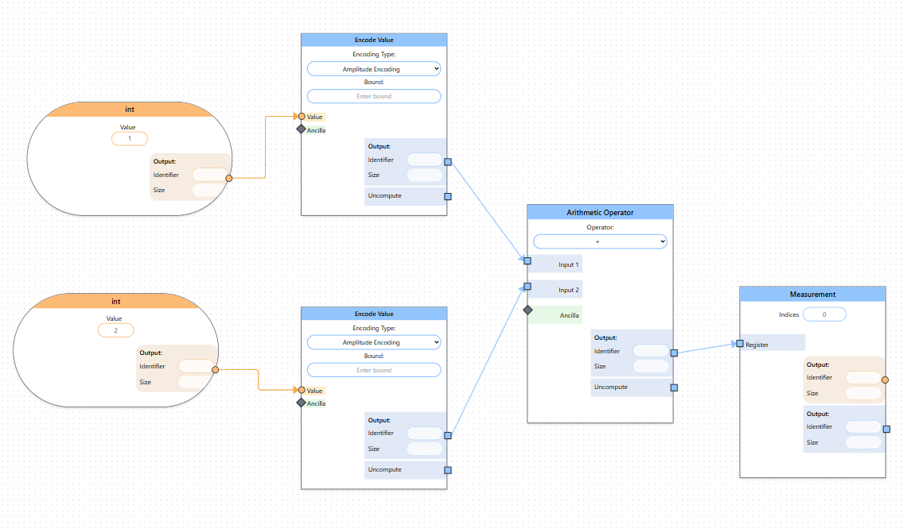

# LEQO Backend 2025 Tutorial

> [!TIP]
> For detailed instructions have a look at the [documentation](https://leqo-framework.github.io/leqo-backend/)

## Prerequisites

- Install [docker](https://docs.docker.com/get-started/get-docker/)

## 0. Start services

In the [./docker](docker/compose.yml) directory you will find a very simple docker compose file to spin up the whole project.

Simply create a new directory on your system and download the [compose.yml](docker/compose.yml) into the new folder.
Then you can simply run the following command.

```sh
docker compose up -d
```

> [!NOTE]
> If you are using docker desktop, ensure it's running

> [!NOTE]
> On linux you will likely have to use `sudo` to communicate with the docker socket.

## 1. Model a simple quantum algorithm

For demonstration purpose we will model a simple addition algorithm that uses qubits to add to integers.

1. Start by dragging two "int" nodes from the palette on the left of the screen.
1. Each integer should be connected to an "Encode Value" node.
1. The resulting qubits from the encoding will both be connected to an "Arithmetic Operator" node.
1. We can the measure the result of the addition with a "Measurement" node.

The final graph should look like this:



## 2. Specify implementations

The backend is capable of providing implementations for simple nodes like "int" and "measure" but does not know how to generate advanced implementations like an encoding or addition.

In production these implementations will be ready from a database.
To simplify things for testing, we will simply manually provide an implementation for these three nodes:

### Encoding Nodes

```
OPENQASM 3.0;
include "stdgates.inc";

@leqo.input 0
int[32] val;

qubit[3] q;
x q[0];

@leqo.output 0
let out = q;
```

### Arithmetic Operator

```
OPENQASM 3.0;
include "stdgates.inc";

@leqo.input 0
qubit[3] q31;

@leqo.input 1
qubit[3] q32;

qubit[2] q33;ccx q31[1], q32[1], q32[2];
cx q31[1], q32[1];
ccx q31[0], q32[0], q33[1];
cx q31[0], q32[0];
ccx q33[0], q32[0], q33[1];
ccx q33[1], q32[1], q32[2];
cx q33[1], q32[1];
ccx q33[0], q32[0], q33[1];
cx q31[0], q32[0];
ccx q31[0], q32[0], q33[1];
cx q33[0], q32[0];
cx q31[0], q32[0];

@leqo.output 0
let out = q32;
```

> [!TIP]
> Detailed explanation on the `@leqo.*` annotations can be found in the [backend documentation](https://leqo-framework.github.io/leqo-backend/usage/annotations.html#annotations).

## 3. Specify parameters

Let's specify the values of the two integers we want to add and select which qubits to measure.

## 4. Generate final program

Now, all that's left to do is to generate actual `OPENQasm 3` code we can execute on some quantum computer.

To do so, simply click "Send to Backend".

> [!WARNING]
> Currently the implementation will only be visible in the DevTools of the frontend!
