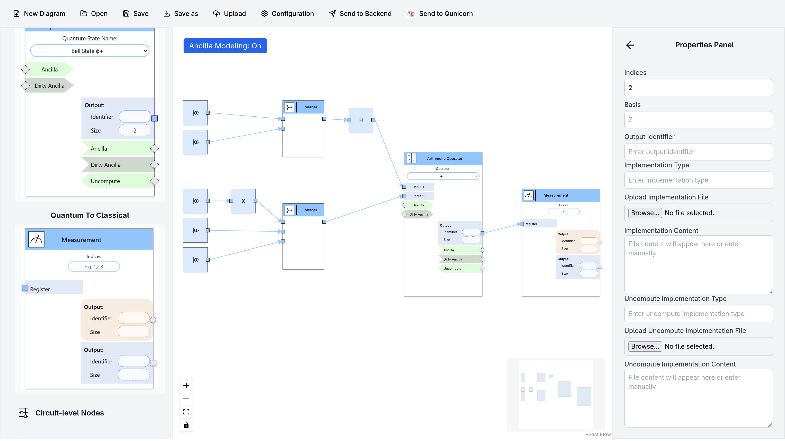
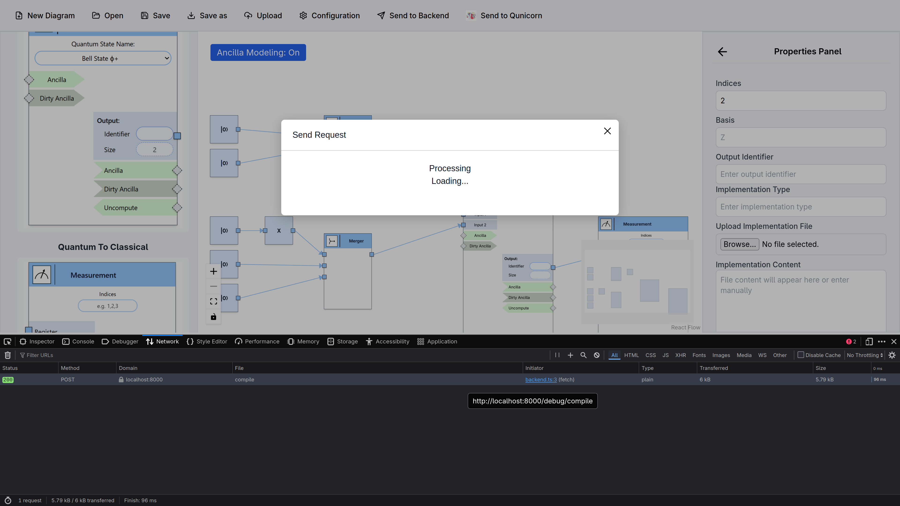

# LEQO Backend 2025 Tutorial

> [!TIP]
> For detailed instructions have a look at the [documentation](https://leqo-framework.github.io/leqo-backend/)

## Prerequisites

- [Install Docker](https://docs.docker.com/install/)
- [Install Docker Compose](https://docs.docker.com/compose/install/)
- [Clone this repository](https://github.com/LEQO-Framework/LEQO-Use-cases)
- (Optional) [Install Python](https://www.python.org/downloads/)
- (Optional) [Install curl](https://curl.se/download.html)

## 0. Service Setup

### Docker Setup

Navigate to the [./docker/](./docker/) directory.
Then run the following command:

```sh
docker compose up -d
```

> [!NOTE]
> The `-d` flag is **optional**.
> It runs the containers in the background (detached mode) and keeps them running even after the command execution is complete.

> [!WARNING]
> If you are using docker desktop, ensure it's running

> [!WARNING]
> On linux you will likely have to use `sudo` to communicate with the docker socket.

### Configure the Frontend

You need to configure the path to the backend in the frontend UI.

1. Open the frontend in a web browser: [http://localhost](http://localhost)
1. Click on **Configuration**
1. Insert `http://localhost:8000` into the "Low-Code Backend Endpoint" field
1. Click on **Save**

### (Optional) Insert Implementations into the Backend

If you want to load the implementation for the addition later via the database, you need to add it now.

Navigate to the [./resources/scripts/](./resources/scripts/) directory.
Now you have to options:

#### Use Python

```sh
python3 ./request_helper.py ./addition_insert.json
```

#### Use curl

```sh
curl -X POST -H "Content-Type: application/json" --data @./addition_insert.json http://localhost:8000/insert
```

---

Both options have equivalent semantic, just use what is more convenient for you.

> [!TIP]
> Detailed explanation on the `@leqo.*` annotations used in that implementation can be found in the [backend documentation](https://leqo-framework.github.io/leqo-backend/usage/annotations.html#annotations).

## 1. Test the Backend via the Frontend

### Build the Model

We will now model this simple algorithm in the frontend:



> [!TIP]
> You can use the stored [frontend model](./resources/scripts/frontend_model.json) to load the model directly.

Here is a small textual description on how to build it:

1. Drag five _|1⟩_ nodes (under **Circuit-level Nodes**) into the graph
1. Drag two _H_ nodes (under **Circuit-level Nodes**) into the graph
1. Drag two _Merger_ nodes (under **Circuit-level Nodes**) into the graph
    - Click on the _Merger_ node
    - Insert into **Number of Inputs**: 2 for the upper merger, 3 for the lower
1. Drag one _Arithmetic Operator_ node (under **Operators**) into the graph
    - If you have not inserted the implementation for this node as described [here](<###-(Optional)-Insert-Implementations-into-the-Backend>), you need to insert it
    - Click on the _Arithmetic Operator_ node
    - Insert the content of [addition_impl.txt](./resources/scripts/addition_impl.txt) into the **implementation Content** field
1. Drag one _Measurement_ node (under **Boundary Nodes**) into the graph
    - Click on the _Measurement_ node
    - Insert into **Indicies**: 2
1. Connect the nodes as can be seen in the image:
    - Two qubits _|1⟩_ into the upper merger
    - The output of this merger into one Hadamard _H_ gate
    - The output of this gate into the upper entry of the _Arithmetic Operator_
    - One of the lower qubits into the second Hadamard _H_ gate
    - The Hadamard output and the reaming qubits into the lower merger
    - The output of the merger into the second entry of the _Arithmetic Operator_
    - The output of the _Arithmetic Operator_ into the _Measurement_

### See the Result

The frontend is unable to display the result yet.
However, we can see it via the DevTools of our web browser

1. Open the DevTools
1. Navigate to the **Network** tab
1. Press on **Send to Backend** in the frontend
1. You should now see a successful request in the **Network** tab:
   
1. Clicking on it should open the result in another tab

## 2. Test the Backend via Terminal

The backend can also be accessed directly using python or curl.
The sections below use stored a compile_request with the same semantic as the model in the [frontend section](##-1.-Test-the-Backend-via-the-Frontend) had.

> [!NOTE]
> All command in this section assume that you are in the [./resources/scripts/](./resources/scripts/) directory.

### Send Compile Request with Hardcoded Addition implementation

This variation works without the insert described [here](<###-(Optional)-Insert-Implementations-into-the-Backend>).
You can use one of the following options:

#### Use Python

```sh
python3 ./request_helper.py compile_request_with_addition.json --endpoint http://localhost:8000/debug/compile
```

#### Use curl

```sh
curl -X POST -H "Content-Type: application/json" --data @./compile_request_with_addition.json http://localhost:8000/debug/compile
```

### Send Compile Request with Database Retrieval

This variation uses the implementation from the database, assuming you inserted it [here](<###-(Optional)-Insert-Implementations-into-the-Backend>).
You can use one of the following options:

#### Use Python

```sh
python3 ./request_helper.py compile_request_without_addition.json --endpoint http://localhost:8000/debug/compile
```

#### Use curl

```sh
curl -X POST -H "Content-Type: application/json" --data @./compile_request_without_addition.json http://localhost:8000/debug/compile
```

## 3. Analyse the Result

All the methods described above should give you the same result matching [./resources/scripts/compile_result.qasm](./resources/scripts/compile_result.qasm).

> [!WARNING]
> Building the model yourself will result in different node ids in the frontend and therefore in a different output!

The following backend behavior can be observed on by this example:

### All Qubit Declarations to the Top

The backend declares all qubits using one big qubit register at the top of the program.

```qasm
OPENQASM 3.1;
include "stdgates.inc";
qubit[8] leqo_reg;
```

### Renaming

All identifier where prefixed with a hash corresponding to one frontend node.

```qasm
/* Start node d703bb61-3410-43ce-be51-4750fb7b9f0f */
let leqo_b8d0652a44085419a43031521aab072e_literal = leqo_reg[{0}];
@leqo.output 0
let leqo_b8d0652a44085419a43031521aab072e_out = leqo_b8d0652a44085419a43031521aab072e_literal;
/* End node d703bb61-3410-43ce-be51-4750fb7b9f0f */
/* Start node 5b427a52-047a-4cbc-b4f4-6705a2b4b0bb */
let leqo_b7e9559cda9e59e2ae8e5e0b5a9689b0_literal = leqo_reg[{1}];
@leqo.output 0
let leqo_b7e9559cda9e59e2ae8e5e0b5a9689b0_out = leqo_b7e9559cda9e59e2ae8e5e0b5a9689b0_literal;
/* End node 5b427a52-047a-4cbc-b4f4-6705a2b4b0bb */
```

### Automated Node Generation

The _Merger_ nodes are auto generated matching their input.

```qasm
/* Start node 185ddc2f-34f7-415a-9e8c-bd0f7cd1ff62 */
@leqo.input 0
let leqo_361ab059e1005696a32d68dfa1946b38_merger_input_0 = leqo_reg[{1}];
@leqo.input 1
let leqo_361ab059e1005696a32d68dfa1946b38_merger_input_1 = leqo_reg[{0}];
@leqo.output 0
let leqo_361ab059e1005696a32d68dfa1946b38_merger_output = leqo_361ab059e1005696a32d68dfa1946b38_merger_input_0 ++ leqo_361ab059e1005696a32d68dfa1946b38_merger_input_1;
/* End node 185ddc2f-34f7-415a-9e8c-bd0f7cd1ff62 */
```

Furthermore, the _|1⟩_, _H_ and _Measurement_ nodes are also auto generated.

### Size Cast

The inputs into the _Arithmetic Operator_ node are to small for it, the backend casts them up to make them fit.

```qasm
/* Start node 6ca13c69-36cf-4771-b8c4-0f5804cc7d6e */
@leqo.input 0
let leqo_b8f3c6982d375661bb24e30358b24281_q34 = leqo_reg[{1, 0}];
let leqo_b8f3c6982d375661bb24e30358b24281_q35 = leqo_reg[{7}];
let leqo_b8f3c6982d375661bb24e30358b24281_q31 = leqo_b8f3c6982d375661bb24e30358b24281_q34 ++ leqo_b8f3c6982d375661bb24e30358b24281_q35;
@leqo.input 1
let leqo_b8f3c6982d375661bb24e30358b24281_q32 = leqo_reg[{4, 3, 2}];
let leqo_b8f3c6982d375661bb24e30358b24281_q33 = leqo_reg[{5, 6}];
```

### Deterministic Output

Sending the compile request multiple times yields the same result.

### More Features not visible in this Example

- Optimization via ancilla reusage
- Inlining of constants
- Convert from OpenQASM 2 to OpenQASM 3
- Nested nodes like If-Then-Else and Repeat
